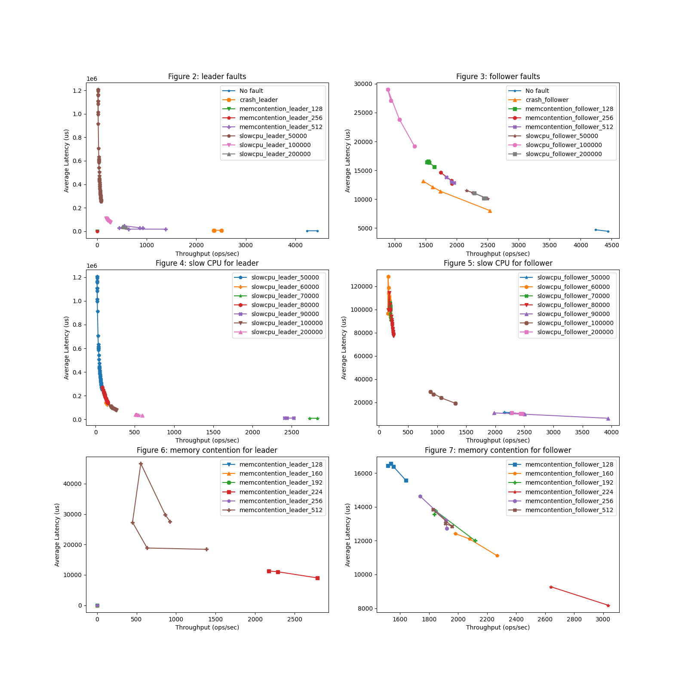

<h3 align="center"> Assignment #2: Testing Reliability of Quorum Systems</h1>

Shuyang Ji (sji15)

#### 1. Select a Quorum System

**Q1: What is your quorum system of choice?**

TiKV, a distrbuted key-value stroage that relies on the Multi-Raft provided by Raftstore for data replicating and strong consistency, and RocksDB for persistence. 

#### **2. Run The Quorum System and Measure The Baseline Performance**

**Q2: Please describe your configuration.**
The experiments are run on a Ubuntu VM within MacOS with 8 cores CPU (M1 ARM) and 8 GB of memory.

I use go-ycsb (the Golang port of YCSB) as the client to measure performance.

**Q3: What is your client workload?**

I use a client workload of 10000 record count, 100000 operation count and 0.5/0.5 read/update proportion. Update operations are used for plotting and analysis.

Based on the experiment results of 1-32 threads (see Q4), 26 hits the max throughput. 

I conclude the bottleneck is the CPU as it exceeded the 100% CPU utilization. 

**Q4: What is your baseline performance? Plot the throughput-latency figure.**

#### **3. Fail-Injection Testing**

**Q5: How do you simulate crash, slow CPU and memory contention?**

<b>Crash:</b> By killing the process of targeted node. 

<b>Slow CPU:</b> By configuring cgroups (`cpu.cfs_quota_us` and `cpu.cfs_period_us`) to limit CPU usage of the process of targeted node in a given amount of time. 

Initially, I limited a node to use CPU for 0.05, 0.1 and 0.2 seconds out of every 1 second.

<b>Memory contention:</b> By configuring cgroups to limit memory usage of the process of targeted node. 

Initially, I limited a node to use 128/256/512 MB memory.

**Q6: Please plot the performance with faults on the** **leader** **node and compare it with the baseline performance.**

See Figure 2.

**Q7: Please explain the above results. Is it expected? Why or why not?**

It is observed that killing the leader node will only slightly affect the operations. This is consistent with Raft and TiKV's fault tolerance design.

For slow CPU, initially, I limited a node to use CPU for 0.05, 0.1 and 0.2 seconds out of every 1 second. It is observed that operations are slowed down but can still be processed. When the leader can only use the CPU up to 0.1s out of 1s, the throughput is 16% of the benchmark performance. In particular, when the leader is limited to use CPU 0.05s out of 1s, the throughput is extremely close to 0 and the latency is at the scale of $10^5-10^6$ microseconds. Additional quota values between 0.05 and 0.1 seconds are picked in Q10 for further experiments. 

For memory contention, initially, I limited a node to use 128/256/512 MB memory. It is observed that when leader can only use 512MB memory, the throughput is 25% of the benchmark performance. However, when the leader can only make use of 256MB  or less memory, the update operations will fail and continue to throw exceptions `batchRecvLoop fails when receiving, needs to reconnect`, `mark store's regions need be refill` and `init create streaming fail` ([See full log](https://github.com/94rain/tikv-experiment/blob/main/logs/memcontention_leader_256)). This is unexpected as fault tolerance does not work. It is expected to elect a new leader when it fails to process operations. Additional quota values between 256MB and 512MB are picked in Q10 for further experiments.

We obtain an initial conclusion that for slow CPU on leader, operations are slowed down but can still be processed but memory contention on the leader could result in operation failures.

**Q8: Please plot the performance with faults on the** **follower** **node and compare it with the baseline performance.**

See Figure 3.

**Q9: Please explain the above results. Is it expected? Why or why not?**

(Configurations here are the same as Q7)

It is observed that killing a follower node will only slightly affect the operations. This is consistent with Raft and TiKV's fault tolerance design.

For slow CPU, it is observed that when a follower can use CPU up to 0.2s out of 1s, the throughput is 60% of the benchmark performance and the latency is twice. The impact seems less compared to slow CPU on the leader.

We obtain an initial conclusion that for either slow CPU or memory contention on follower, operations are slowed down but can still be processed. The performance degradation of these faults on follower is less than leader.

**Q10: For the slow CPU and memory contention, could you vary the level of slowness/contention and report the results?**

Following Q7 and Q9, further quota values are picked for further experiments. For slow CPU, values between 0.1s and 0.05s with a step decrease of 0.01s (out of 1s) are picked. For memory contention, values between 256MB and 512MB with a step decrease of 32MB are picked.

For slow CPU on leader, from Figure 4 we can confirm that operations are slowed down but can still be processed. We found flakniess that when leader can use CPU up to 0.09 or 0.07s out of 1s, the throughput is higher 

The relation is not a straightly negative correlation due to flakiness. 

We found 

For slow CPU on 

I found the result can be a bit flaky. In one run, 160MB memory limit of a follower will not affect update operations. However, 192 MB will cause `mark store's regions need be refill` exception and result in very low throughoutput and long latency.

For slow CPU, no node will throw exceptions. For cases when either leader or follower is on the slow CPU, the 

#### Metadata

The repository can be found at https://github.com/94rain/tikv-experiment.

#### References
1. [TiUp manual](https://github.com/pingcap/tiup/blob/master/doc/user/overview.md)
2. [go-ycsb manual](https://github.com/pingcap/go-ycsb)
3. [CPU Cgroup guide](https://access.redhat.com/documentation/en-us/red_hat_enterprise_linux/6/html/resource_management_guide/sec-cpu)
4. [Memory Cgroup guide](https://access.redhat.com/documentation/en-us/red_hat_enterprise_linux/6/html/resource_management_guide/sec-memory)
